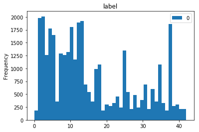
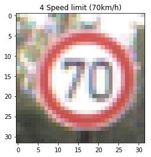
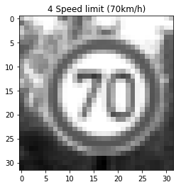
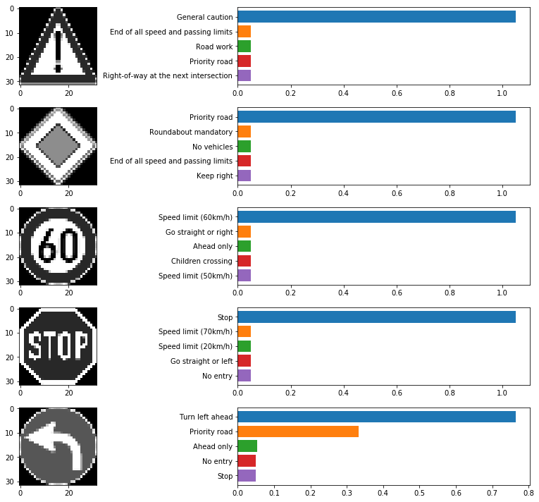

# Writeup

**Build a Traffic Sign Recognition Project**

The goals / steps of this project are the following:
* Load the data set (see below for links to the project data set)
* Explore, summarize and visualize the data set
* Design, train and test a model architecture
* Use the model to make predictions on new images
* Analyze the softmax probabilities of the new images
* Summarize the results with a written report

This project is used to classify traffic signs.The network structure used is similar to Lenet

You're reading it! and here is a link to my [project code](https://github.com/dmlstarry/CarND/P2 CarND-Traffic-Sign-Classifier-Project/Traffic_Sign_Classifier.ipynb)

## Data Set Summary & Exploration

I used the pandas library to calculate summary statistics of the traffic
signs data set:

* The size of training set is 34799
* The size of the validation set is 4410
* The size of test set is 12630
* The shape of a traffic sign image is 32x32x3
* The number of unique classes/labels in the data set is 43

Here is an exploratory visualization of the data set. 

## Design and Test a Model Architecture

 1. As a first step, I decided to convert the images to grayscale because it reduce the amount of calculation without affecting the accuracy.Here is an example of a traffic sign image before and after grayscaling.

  

2. As a last step, I normalized the image data because after normalization the gradient descent is accelerated to solve the optimal solution
    

 3. The data set is uniformly preprocessed, and the input of the model is a np array of shape (X, 32, 32, 1).The network structure is based on LENET5, adding two layers of Dropout on the full connection layer, preventing the fitting.

    My final model consisted of the following layers:

| Layer         		|     Description	        					| 
|:---------------------:|:---------------------------------------------:| 
| Input         		| 32x32x1 GRAY image   							| 
| Convolution 3x3     	| 1x1 stride, same padding, outputs 32x32x16 	|
| RELU					|												|
| Max pooling	      	| 2x2 stride,  outputs 16x16x16				    |
| Convolution 3x3	    | 1x1 stride, same padding, outputs 16x16x43  	|
| RELU					|												|
| Max pooling	      	| 2x2 stride,  outputs 8x8x43				    |
| Flatten               | outputs 2752                                  |
| Fully connected		| outputs 512  									|
| RELU					|												|
|	    Drop Out		|keep_prob=0.5								    |
| Fully connected		| outputs 128  									|
| RELU					|												|
|	    Drop Out		|keep_prob=0.5								    |
| Fully connected		| outputs 43  									|
 

4. To train the model, I used an Adam optimizer to minmize average cross_entropy.Batch Size set 128,learning
rate = 0.001.And do one_hot for label.

5. My final model results were:
    * training set accuracy of 0.997
    * validation set accuracy of 0.952
    * test set accuracy of 0.936
 

## Test a Model on New Images

1. Here are five German traffic signs that I found on the wiki:

  

  
2. Here are the results of the prediction.The model was able to correctly guess 5 of the 5 traffic signs, which gives an accuracy of 100%. 

| Image			        |     Prediction	        					| 
|:---------------------:|:---------------------------------------------:| 
| General caution     	| General caution  						    	| 
| Priority road   		| Priority road							    	|
| Speed limit 60		| Speed limit 60								|
| Stop	      		    | Stop				 			            	|
| Turn left ahead		| Turn left ahead      							|

  
    
    
3. Hera are the top five softmax probabilities for the predictions on the German traffic sign images found on the web. 

