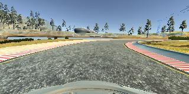
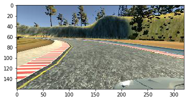
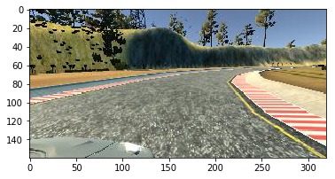

# Behavioral Cloning Project

The goals / steps of this project are the following:
* Use the simulator to collect data of good driving behavior
* Build, a convolution neural network in Keras that predicts steering angles from images
* Train and validate the model with a training and validation set
* Test that the model successfully drives around track one without leaving the road
* Summarize the results with a written report

## Rubric Points
Here I will consider the [rubric points](https://review.udacity.com/#!/rubrics/432/view) individually and describe how I addressed each point in my implementation.  

---
### Files Submitted & Code Quality

#### 1. Submission includes all required files and can be used to run the simulator in autonomous mode

My project includes the following files:
* model.py containing the script to create and train the model
* drive.py for driving the car in autonomous mode
* model.h5 containing a trained convolution neural network 
* writeup_report.md or writeup_report.pdf summarizing the results

#### 2. Submission includes functional code
Using the Udacity provided simulator and my drive.py file, the car can be driven autonomously around the track by executing 
```sh
python drive.py model.h5
```

#### 3. Submission code is usable and readable

The model.py file contains the code for training and saving the convolution neural network. The file shows the pipeline I used for training and validating the model, and it contains comments to explain how the code works.

### Model Architecture and Training Strategy

#### 1. An appropriate model architecture has been employed

I'm using the NVIDIA model, just adding the parameters of the full connection layer.

#### 2. Attempts to reduce overfitting in the model

I added 0.5 rate Dropout in the full connection layers,then I can finish the track at the fastest speed.

#### 3. Model parameter tuning

The model used an adam optimizer, so the learning rate was not tuned manually .

#### 4. Appropriate training data

I used the data provided by Udacity, and of course I recorded a few laps of data myself, trying to keep the car in the middle of the driveway.To ensure that there are more angles of data, when cross the bend, pounding on the direction key

For details about how I created the training data, see the next section. 

### Model Architecture and Training Strategy

#### 1. Solution Design Approach

My first step was to use a convolution neural network model similar to the NVIDIA model, I thought this model might be appropriate because this is a practiced unmanned model.

And I use Dropout to reduce overfitting.

To confirm that the generator has no problem, use reverse data training and then use positive data training.

The final step was to run the simulator to see how well the car was driving around track one. There were a few spots where the vehicle fell off the track, especially some corners. To improve the driving behavior in these cases, I expand data from the left and right cameras and doubled the amount of data on the flip.

At the end of the process, the vehicle is able to drive autonomously around the track without leaving the road.


#### 2. Final Model Architecture

The final model architecture  consisted of a convolution neural network with the following layers and layer sizes:


#### 3. Creation of the Training Set & Training Process
To capture good driving behavior, I first recorded three laps on track one using center lane driving. Here is an example image of center lane driving:



Then I specifically added about 900 pieces of data in two curves after crossing the bridge.

To augment the data sat, I also flipped images and angles thinking that this would better training vehicles. For example, here is an image that has then been flipped:





After the collection process, I had 41013 number of data points. I then preprocessed this data by 'lambda x: (x / 255.0) - 0.5' to normalizing the data and mean centering the data.

I finally randomly shuffled the data set and put 10% of the data into a validation set.

#### 4. Here are a few tips
* Don't cut too much
* Remember to convert the color field to RGB
* Sometimes there are no local images, and actively skip them
* You can train your data on a particular bend

 

